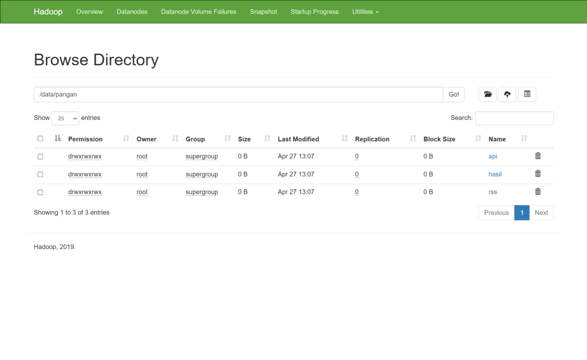

# HargaPangan: Big Data Pipeline Monitoring System (Kelompok 6)

## 📋 Profil Tim
* **Imam Mahmud Dalil Fauzan** - (Setup Infrastructure & Docker)
* **Kanafira Vanesha Putri** - (Producer API Real-time)
* **Adiwidya Budi Pratama** - (Producer RSS & Consumer to HDFS)
* **Theodorus Aaron Ugraha** - (Spark Analysis)
* **Oscaryavat Viryavan** - (Flask Dashboard)

## 🏗️ Topik & Justifikasi
Kami memilih topik **HargaPangan** untuk memantau fluktuasi harga komoditas bahan pokok (Beras, Cabai, Minyak Goreng, dll.) secara real-time.

Sistem ini bertujuan memberikan *early warning* bagi pihak terkait (seperti Bulog) dengan mengorelasikan data harga dari API dengan berita ekonomi terkini dari RSS Feed Bisnis.com dan Kompas.

## ⚙️ Arsitektur Sistem
Sistem ini dibangun dengan pipeline end-to-end sebagai berikut:
1.  **Ingestion:** Data diambil via Python Producer dan dikirim ke **Apache Kafka**.
2.  **Storage:** Data dari Kafka dibaca oleh Consumer dan disimpan ke **Hadoop HDFS** dalam format JSON bertanda waktu.
3.  **Processing:** **Apache Spark** membaca data dari HDFS untuk melakukan analisis volatilitas dan tren.
4.  **Serving:** Hasil analisis ditampilkan melalui **Flask Dashboard** yang melakukan auto-refresh.

## 🚀 Cara Menjalankan Sistem

### 1. Persiapan Infrastruktur (Docker)
Jalankan Hadoop dan Kafka menggunakan Docker Compose:
```bash
# Jalankan Hadoop
docker-compose -f docker-compose-hadoop.yml up -d

# Jalankan Kafka
docker-compose -f docker-compose-kafka.yml up -d
```

## 🛠️ Dokumentasi Pengerjaan
### Fauzan - Anggota 1
- Membuat Repo Github `https://github.com/imdfauzan/BigData-ETS`
- Setup environment docker `docker-compose-kafka.yml`, `docker-compose-hadoop.yml`, dan `hadoop.env`
```bash
# setup env kafka dan hadoop
docker network create bigdata-network
docker-compose -f docker-compose-kafka.yml up -d
docker-compose -f docker-compose-hadoop.yml up -d

# buat folder di hdfs
docker exec -it namenode hdfs dfs -mkdir -p /data/pangan/api
docker exec -it namenode hdfs dfs -mkdir -p /data/pangan/rss
docker exec -it namenode hdfs dfs -mkdir -p /data/pangan/hasil

# beri akses hadoop 
docker exec -it namenode hdfs dfs -chmod -R 777 /data/pangan

# verif hasil, harus muncul folder /api, /rss, /hasil
docker exec -it namenode hdfs dfs -ls -R /data/pangan/
```


### Kanafira Vanesha — Anggota 2 (`kafka/producer_api.py`)
 
**Tanggung jawab:** Mengambil data harga komoditas real-time dan mengirimnya ke Kafka topic `pangan-api` setiap 30 menit.
 
**Strategi sumber data (prioritas berurutan):**
1. **Panel Harga Badanpangan** (`panelharga.badanpangan.go.id`) — sumber utama, data harian harga nasional
2. **World Bank Commodity API** — fallback untuk jagung, kedelai, gula (data global dalam USD, dikonversi ke IDR)
3. **Simulator Realistis** — fallback wajib jika kedua API gagal; menggunakan random walk + mean reversion berbasis data historis BPS Maret 2024
**Fitur utama:**
- Retry otomatis koneksi Kafka (5 percobaan dengan backoff)
- Kompresi `gzip` untuk efisiensi jaringan
- `acks="all"` untuk memastikan tidak ada data yang hilang
- Logging lengkap per komoditas dengan indikator naik/turun
**Format event JSON yang dikirim ke `pangan-api`:**
```json
{
  "message_id": "a1b2c3d4e5f6",
  "schema_version": "1.0",
  "komoditas": "beras",
  "label": "Beras",
  "harga": 14500.0,
  "satuan": "kg",
  "wilayah": "Nasional",
  "harga_acuan": 14500,
  "perubahan_pct": 0.5,
  "sumber": "badanpangan",
  "tanggal": "2026-04-20",
  "jam": "14:00:00",
  "timestamp_iso": "2026-04-20T14:00:00.123456",
  "timestamp_unix": 1745150400,
  "pipeline": "pangan-monitor",
  "topic": "pangan-api"
}
```
 
```bash
# Menjalankan producer API
python kafka/producer_api.py
 
# Verifikasi event masuk ke Kafka
docker exec -it kafka-broker kafka-console-consumer.sh \
  --topic pangan-api --from-beginning --bootstrap-server localhost:9092 --max-messages 5
```
 
> 
 
---
 
### Adiwidya Budi P — Anggota 3 (`kafka/producer_rss.py` + `kafka/consumer_to_hdfs.py`)
 
**Tanggung jawab:** Dua komponen sekaligus — mengambil berita dari RSS feed dan menyimpan semua data ke HDFS.
 
#### producer_rss.py
 
Polling 4 RSS feed berita ekonomi/komoditas Indonesia setiap **5 menit**:
- `kontan.co.id/rss/bisnis`
- `ekonomi.bisnis.com/feed/rss`
- `rss.detik.com/index.php/detikfinance`
- `katadata.co.id/feed`
**Fitur utama:**
- Parsing menggunakan library `feedparser` — ekstrak `title`, `link`, `summary`, `published`
- **Deduplication** via `sent_ids: set` — setiap `entry.link` disimpan; entry yang sama tidak dikirim ulang di polling berikutnya
- Deteksi komoditas otomatis dari teks berita (keyword matching)
- `acks="all"` + `enable_idempotence=True` untuk reliability
- Fallback graceful jika salah satu feed down (lanjut ke feed berikutnya)
**Format event JSON yang dikirim ke `pangan-rss`:**
```json
{
  "title": "Harga beras naik 3% jelang akhir bulan",
  "link": "https://bisnis.com/artikel/harga-beras-naik",
  "summary": "Harga beras medium di pasar tradisional...",
  "published": "Mon, 20 Apr 2026 14:00:00 +0700",
  "source_feed": "https://ekonomi.bisnis.com/feed/rss",
  "komoditas": "beras",
  "timestamp": "2026-04-20 14:00:05",
  "topic": "pangan-rss"
}
```
 
#### consumer_to_hdfs.py
 
Membaca kedua topic Kafka secara **paralel** (threading) dan menyimpan ke HDFS.
 
**Fitur utama:**
- **2 thread terpisah** — satu thread per topic (`pangan-api` dan `pangan-rss`), berjalan paralel
- **Buffering** — event dikumpulkan selama 2 menit, lalu di-flush sekali ke satu file JSON
- `group_id="pangan-hdfs-consumer"` — agar offset ter-track di Kafka dan bisa diverifikasi via `--describe`
- Nama file format timestamp: `2026-04-20_14-30.json`
- Penyimpanan via `subprocess.run()` (docker cp + hdfs dfs -put)
- **Graceful shutdown** — sisa buffer di-flush saat Ctrl+C
**Alur penyimpanan:**
```
Kafka message diterima
    → dikumpulkan dalam buffer list (per topic)
    → setiap 2 menit: tulis ke /tmp/pangan_buffer/[topic]/[timestamp].json
    → docker cp ke container namenode
    → hdfs dfs -put ke /data/pangan/[api|rss]/
    → file lokal dihapus
```
 
```bash
# Jalankan producer RSS
python kafka/producer_rss.py
 
# Jalankan consumer (di terminal terpisah)
python kafka/consumer_to_hdfs.py
 
# Verifikasi consumer group terdaftar di Kafka
docker exec -it kafka-broker kafka-consumer-groups.sh \
  --bootstrap-server localhost:9092 \
  --describe --group pangan-hdfs-consumer
 
# Verifikasi file JSON tersimpan di HDFS
docker exec -it namenode hdfs dfs -ls /data/pangan/api/
docker exec -it namenode hdfs dfs -ls /data/pangan/rss/
```
 
> 
 
---

### Aaron - Anggota 4
- Membuat file `spark/analysis.ipynb`.
- Mengonversi Jupyter Notebook menjadi skrip Python independen `spark/analysis.py` agar dapat dijalankan via terminal.
- Memperbaiki konfigurasi koneksi URI HDFS Spark ke `hdfs://localhost:9000/` menyesuaikan dengan port mapping dari Docker.
- Membuat *mock data* JSON (data tiruan) langsung ke HDFS untuk pengujian.
- Berhasil mengeksekusi analisis data dan menyimpannya kembali ke HDFS serta lokal.

Cara menjalankan analisis Spark (`spark/analysis.py`):

```bash
# Menjalankan menggunakan spark-submit (pastikan PySpark terinstal)
spark-submit spark/analysis.py

# Atau jalankan menggunakan Python biasa
python3 spark/analysis.py
```
